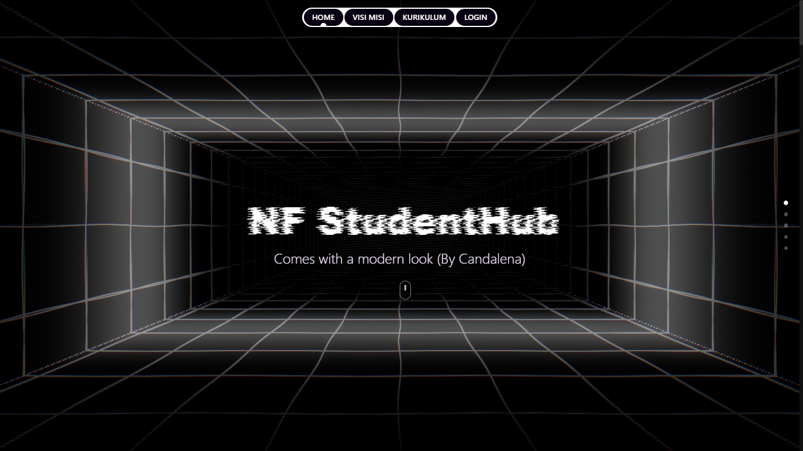

# 🎓 NF StudentHub





NF StudentHub adalah platform digital terintegrasi untuk ekosistem akademik STT Nurul Fikri, yang menghubungkan Mahasiswa, Dosen, Admin, Orang Tua, UKM, dan ORMAWA dalam satu sistem web yang modern, aman, dan scalable.

> One platform. One ecosystem. One academic experience.

## 📌 Gambaran Umum

NF StudentHub dirancang sebagai one-stop academic platform untuk memusatkan layanan kampus:
- Manajemen akademik (mata kuliah, pertemuan, nilai)
- Sistem pembayaran UKT dengan invoice & status
- Absensi berbasis QR (dosen dan mahasiswa)
- Komunikasi real-time via WebSocket
- Media informasi kampus (feed ala sosial media)

Sistem berbasis role memastikan setiap pengguna hanya mengakses fitur sesuai perannya.

---

## ✨ Fitur Utama

### 🎓 Mahasiswa
- Dashboard akademik (nilai & kehadiran)
- Akses materi dan tugas per mata kuliah
- Pembayaran UKT & tracking invoice
- Transkrip nilai & IPK
- Scan absensi QR Code
- Chat & notifikasi real-time
- Profil publik mahasiswa

### 👨‍🏫 Dosen
- Kelola mata kuliah & pertemuan
- Upload materi & tugas
- Input nilai mahasiswa
- Generate QR absensi
- Komunikasi dengan mahasiswa

### 🛠️ Admin
- Manajemen akun pengguna
- Posting pengumuman kampus
- Monitoring pembayaran UKT
- Pengaturan sistem
- Dashboard analytics

### 👨‍👩‍👧 Orang Tua
- Monitoring kehadiran mahasiswa
- Akses status pembayaran UKT
- Notifikasi real-time
- Akses profil akademik anak

### 🏫 UKM & ORMAWA
- Posting kegiatan & pengumuman
- Kelola profil organisasi
- Interaksi sosial (like & komentar)
- Dashboard organisasi

---


## 🛠️ Teknologi

### Frontend
- React 19
- Vite 7
- Tailwind CSS
- React Router 7
- TanStack React Query 5
- Axios
- GSAP
- Three.js
- MUI + Emotion
- React Icons / Lucide

### Backend
- Go 1.24
- Gin (HTTP framework)
- GORM + MySQL
- JWT Authentication (HS256)
- Gorilla/WebSocket (real-time chat)
- godotenv (env loader)

---

## 🚀 Instalasi

### Prasyarat
- Node.js ≥ 18
- Go ≥ 1.20 (disarankan 1.24)
- MySQL 5.7/8.0
- npm (atau yarn/pnpm)

### Clone & Setup
```bash
git clone https://github.com/HudzaifahArrantisi/NF-STUDENT-HUB.git
cd NF-Student-HUB

# Frontend
cd frontend
npm install

# Backend
cd ../backend
go mod download
```

---

## ⚙️ Konfigurasi

### Backend (.env)
Buat file `.env` di folder backend dan isi minimal:
```env
# Koneksi database (contoh lokal)
DB_DSN=root:@tcp(127.0.0.1:3306)/nf_student_hub3?parseTime=true

# JWT
JWT_SECRET=ubah_ini_dengan_secret_yang_kuat

# Banner ASCII opsional
NAMA=NF StudentHub
```

Catatan:
- Jika `DB_DSN` kosong, backend memakai default: `root:@tcp(127.0.0.1:3306)/nf_student_hub3?parseTime=true`.
- Direktori upload otomatis dibuat: `uploads/posts`, `uploads/materi`, `uploads/tugas`, `uploads/tugasdosen`, `uploads/profile`.
- Static file dapat diakses melalui `/uploads/...` (misal: `http://localhost:8080/uploads/materi/...`).

### Frontend
- Base API default: `http://localhost:8080`. Ubah di [frontend/src/services/api.js](frontend/src/services/api.js).
- Dev server Vite berjalan di: `http://localhost:5173`.

### CORS
Origin pengembangan yang diizinkan:
- http://localhost:5173 (Vite)
- http://localhost:3000

Konfigurasi CORS ada di backend (gin-contrib/cors) dan middleware.

---

## ▶️ Menjalankan Aplikasi

### Development
```bash
# Terminal 1 (Frontend)
cd frontend
npm run dev
# Akses: http://localhost:5173

# Terminal 2 (Backend)
cd backend
go run main.go
# API: http://localhost:8080
```

### Production (Windows)
```bash
# Build frontend
cd frontend
npm run build

# Build backend
cd ../backend
go build -o nf-student-hub.exe
./nf-student-hub.exe
```

---

## 📁 Struktur Proyek

```
NF-Student-HUB/
├── frontend/
│   ├── public/
│   └── src/
│       ├── components/
│       ├── pages/
│       ├── hooks/
│       ├── services/
│       ├── utils/
│       └── main.jsx / App.jsx
│
├── backend/
│   ├── config/
│   ├── controllers/
│   ├── database/
│   ├── handlers/
│   ├── middlewares/
│   ├── models/
│   ├── routes/
│   ├── uploads/
│   └── main.go
└── README.md
```

---

## 👥 Role & Permission

| Role       | Dashboard | Akademik | Chat | Payment | Admin |
|------------|-----------|----------|------|---------|-------|
| Mahasiswa  | ✅        | ✅       | ✅   | ✅      | ❌    |
| Dosen      | ✅        | ✅       | ✅   | ❌      | ❌    |
| Admin      | ✅        | ✅       | ✅   | ✅      | ✅    |
| Orang Tua  | ✅        | ✅       | ✅   | ✅      | ❌    |
| UKM        | ✅        | ❌       | ✅   | ❌      | ✅    |
| ORMAWA     | ✅        | ❌       | ✅   | ❌      | ✅    |

---

## 📚 Ringkasan API

### Auth
- POST /api/auth/login
- POST /api/auth/register
- POST /api/auth/refresh

### Mahasiswa
- GET  /api/mahasiswa/profile
- GET  /api/mahasiswa/courses
- GET  /api/mahasiswa/absensi/summary
- POST /api/mahasiswa/absensi/scan
- POST /api/mahasiswa/tugas/submit

### Dosen
- GET  /api/dosen/profile
- GET  /api/dosen/courses
- POST /api/dosen/materi/upload
- POST /api/dosen/tugas
- PUT  /api/dosen/tugas/{submissionId}/grade

### Admin & UKT
- GET  /api/admin/profile
- GET  /api/admin/ukt/mahasiswa
- POST /api/ukt/bayar
- GET  /api/ukt/status/{uuid}

### Chat
- WS   /ws/chat
- REST /api/chat/... (conversations, messages, contacts, stats)

Detail lengkap rute: lihat folder [backend/routes](backend/routes).

---

## 🔐 Keamanan
- JWT Authentication (HS256)
- Password hashing
- Role-Based Access Control (RBAC)
- Input validation
- CORS protection
- SQL Injection prevention

Penting: jangan commit file `.env`.

---

## 🤝 Kontribusi
1. Fork repository
2. Buat branch fitur: `git checkout -b feature/AmazingFeature`
3. Commit sesuai convention: `git commit -m "feat: add AmazingFeature"`
4. Push: `git push origin feature/AmazingFeature`
5. Buat Pull Request

---

## 📄 Lisensi
Proyek ini dibuat untuk keperluan akademik. Penggunaan komersial memerlukan izin resmi.

---

Terakhir diperbarui: Januari 2026  
Versi: 1.0.0
